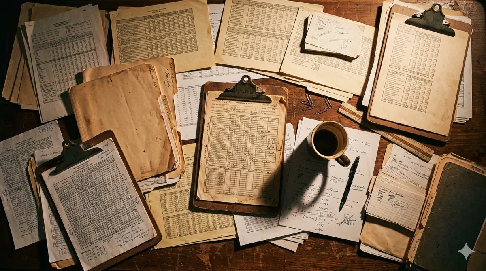

# El AS400, los 102 sistemas y por qué el 78% no cuenta toda la historia

En septiembre de 2025 fui a uno de los hospitales más importantes del Instituto Ecuatoriano de Seguridad Social. Quería ver con mis propios ojos cómo funcionaba la infraestructura tecnológica que sostenía la atención de miles de afiliados. El cerebro del hospital, los servidores que coordinaban historias clínicas, agendamientos, abastecimiento y pagos, era un AS400 corriendo DOS. Era 2025. Estábamos operando un hospital con tecnología de la guerra de 1980.

Esa escena resume mejor que cualquier informe lo que era el IESS por dentro. Una institución que administraba 10.300 millones de dólares anuales, con 32.000 colaboradores y 13 millones de beneficiarios, sostenida en partes críticas por sistemas que ningún ingeniero menor de cuarenta años recordaba haber estudiado.

Dirigí el IESS de junio a diciembre de 2025. Esto es lo que vi desde adentro. No es un relato heroico. Es un registro honesto de lo que se hizo, lo que no se hizo, y por qué la cifra que mejor leyó la prensa, una ejecución presupuestaria que pasó del 36% al 78% en seis meses, no cuenta la mitad de la historia.

Lo escribo porque mientras circulen narrativas de "modernización del Estado" basadas en pantallas táctiles y aplicaciones nuevas, vamos a seguir confundiendo lo cosmético con lo estructural. Y mientras eso pase, los recursos públicos se van a seguir gastando en lo que rinde políticamente, no en lo que de verdad arregla la institución.

---

## Cómo se llega al cargo y qué se encuentra el primer día

Llegué al despacho casi un mes después de que el resto del equipo técnico de la institución ya estaba instalado. Ese desfase es importante. Significa que entré a una operación en marcha, con decisiones tomadas, presupuestos comprometidos y agendas armadas, sin haber participado en ninguna de esas conversaciones previas.

El primer día reuní a las personas de mi despacho directo, una por una, para entender qué hacían y qué frente sostenía cada una. La segunda tarea fue armar mi propio equipo, porque un Director General sin equipo de confianza es alguien que ejecuta decisiones de otros sin ver la información completa que las sustenta.

Esa primera semana hubo una visita del Presidente de la República al IESS. Vinieron los 24 directores provinciales a una recepción institucional. Era una reunión protocolaria, un saludo, una foto. Después de que el Presidente se fue, aproveché que estaban todos en el edificio para sentarlos juntos con mi jefa de despacho y mi asesor a una mesa más larga. Les dije que ya que estaban acá, queríamos escucharlos. Sus preocupaciones, sus alertas, los problemas que llevaban tiempo cargando.

Lo que pasó en esa reunión, y en las que tuve la primera y segunda semana con los directores nacionales en grupos pequeños, varios funcionarios me lo dijeron casi con las mismas palabras. Esto no había pasado antes. Ningún Director General reciente los había sentado a todos juntos a conversar con esta apertura. Algunos llevaban años sin que la dirección central les preguntara cómo veían su provincia o su área.

Esa fue la primera señal de algo más profundo. La distancia entre la cabeza institucional y los directores que de verdad ejecutan no se medía en organigrama. Se medía en años sin conversación.

## Lo que encontré en las primeras semanas

Pedí informes de gestión a 160 personas que reportaban directa o indirectamente a la dirección general. Directores provinciales, directores hospitalarios, direcciones nacionales. No para evaluarlos. Para mapear el estado real antes de tocar nada.

Lo que volvió fue una imagen que se puede resumir en tres observaciones.

**Primera: la columna vertebral del control institucional dependía de una persona próxima a jubilarse.** La unidad encargada de hacer seguimiento a las recomendaciones de Contraloría, mapear procesos abiertos, y mantener el control sobre lo que pasaba con cada glosa, no tenía siquiera el rango de dirección formal. La persona que la lideraba se llamaba "líder", no "directora", y estaba a meses de jubilarse. Si esa persona se iba mañana, una parte crítica del control institucional se quedaba sin operar.

**Segunda: 102 sistemas tecnológicos, ninguno interconectado.** En mi primer mes pedí al equipo de tecnología un inventario honesto. Reportaron 102 sistemas distintos en operación. Cada uno con su contrato, su proveedor, su lenguaje, su interfaz. Ninguno interoperaba con otro. Si un contrato no se renovaba a tiempo, el sistema simplemente se caía. Cada cual había hecho su parte como podía a lo largo de dos décadas, sin un plan central de arquitectura. El resultado agregado era un mosaico de soluciones puntuales montadas una encima de otra.

**Tercera: cada provincia operaba con su propia versión de la realidad.** Los reportes financieros llegaban en Excels diferentes según la regional. Los formatos no eran comparables. Los equipos de cómputo, las versiones de software, las tablas de cálculo, todo era heterogéneo. Cuando dos áreas se sentaban a discutir un mismo dato, traían cifras distintas. La conversación se trababa en armonizar números antes de poder decidir nada.

La frase que terminé usando con mi equipo cuando hablábamos de esto en privado fue exacta. Una de las instituciones más grandes del Ecuador operando como una tienda de barrio.

No es metáfora. Es una descripción técnica. Una tienda de barrio funciona porque su tamaño le permite tolerar la informalidad. Cuando le metes a esa misma lógica un presupuesto de diez mil millones de dólares y trece millones de beneficiarios, el resultado es una institución del tamaño de un país operando con la coordinación informática de un negocio familiar.

Y todavía no había llegado al AS400.

## Lo que sí se hizo en seis meses

La ejecución presupuestaria pasó del 36% al 78%. La cifra es real y está documentada en los reportes oficiales. Pero quiero ser honesto sobre cómo se compone ese número antes de hablar de las decisiones que sí tomamos.

Una parte sustancial del presupuesto del IESS son pensiones, y las pensiones se pagan sí o sí, mes a mes. El componente de ejecución que de verdad refleja gestión activa es el resto: compras de medicinas, contrataciones de servicios médicos, infraestructura, sistemas. En esa parte la mejora fue real, pero llegar al 100% nunca era posible en seis meses, porque depende de las unidades médicas, de los procesos de compra, de la coordinación entre direcciones, y todo eso se mueve en plazos institucionales que no respetan la urgencia política.

Estas son las cuatro decisiones operativas que sí ocurrieron.

**Empezamos por preguntar antes de anunciar.** La mesa con los 24 directores provinciales, las reuniones con direcciones nacionales en grupos pequeños, los informes de gestión solicitados a 160 personas. Antes de tocar un proceso, mapear el terreno. Esto suena obvio. No lo era para la cultura institucional que recibí.

**Instalamos dos mesas semanales con foco operativo en el sistema de citas.** Una mesa técnica con el equipo más cercano. Una mesa ejecutiva con direcciones nacionales. La razón del foco: las citas eran el punto donde el afiliado tocaba la institución y la sentía rota. La realidad operativa que descubrimos pronto fue que las citas estaban agendadas a 90 días, así que cualquier cambio que decidiéramos hoy iba a sentirse en tres meses. La impaciencia política no respeta esa física, pero la operación tampoco se acomoda al tiempo de las redes sociales. Las cifras de cierre del año incluyeron un aumento del 58% en citas de primera vez y un crecimiento del 62% en los canales digitales de atención.

**Negociamos con el Ministerio de Finanzas un acuerdo histórico para empezar a pagar la deuda que el Estado le debía al IESS.** Ese acuerdo se firmó. No se habló mucho del tema en su momento porque otros frentes coyunturales acaparaban la prensa, pero quedó registrado. Para una institución cuya sostenibilidad financiera de largo plazo depende de que el Estado cumpla sus compromisos de pago, esa firma vale más que muchas cifras del corto plazo.

**Iniciamos el trabajo técnico de una propuesta de reforma legal para sostenibilidad del fondo de pensiones sin subir la edad de jubilación.** La propuesta avanzó. No se cerró. La coyuntura política de los últimos meses del año, con un paro nacional por el alza del diésel, un ciclo electoral activo y una emergencia sanitaria en curso, absorbió oxígeno que la reforma necesitaba. El trabajo técnico quedó hecho. El cierre político no se logró durante mi gestión.

A esto se sumaron resultados de control institucional que merecen mención. Identificamos irregularidades por más de 14 millones de dólares y activamos correctivos administrativos y disciplinarios. Empezamos a construir tableros de inteligencia de negocios para seguimiento de ejecución, indicadores de desempeño y abastecimiento. Estos tableros no estaban terminados cuando salí. Estaban en construcción. Era una de las apuestas más importantes para el siguiente trimestre.

## Lo que no se hizo y sí era importante

Aquí viene la parte que casi nadie publica.

La aprobación y ejecución del plan de transformación digital integral del IESS no se logró durante mi gestión. Ese plan, que llevábamos meses diseñando con el equipo técnico, no era una colección de aplicaciones nuevas ni un rediseño de imagen. Era el cambio estructural que de verdad iba a sacar a la institución del modo tienda de barrio.

Cubría tres frentes. La modernización del modelo de atención médica completa, incluyendo la interoperabilidad de los sistemas hospitalarios y el reemplazo gradual de infraestructura legacy como la del AS400. El sistema del Seguro Social Campesino, que opera con condiciones únicas en el país y necesitaba su propia arquitectura digital. Y el sistema de abastecimiento hospitalario, que era el que estaba colapsando visiblemente y por el que se llegó a declarar emergencia sanitaria.

Ese plan, aprobado y ejecutado, era la diferencia entre seguir parchando o empezar a construir. Quedó en la mesa. Y mientras quedó en la mesa, lo que avanzaba en paralelo era la modernización cosmética. Pantallas táctiles. Kioscos K2. Aplicaciones nuevas montadas sobre la misma infraestructura sin actualizar.

Para mucha gente dentro y fuera de la institución, modernizar el IESS era exactamente eso. Comprar aparatos K2 bonitos. Esa es la modernización que se inaugura, la que sale en fotos, la que se anuncia en ruedas de prensa. La que de verdad cambia una institución es la que no se ve y lleva años, y por lo tanto rinde poco políticamente.

## Sobre la resistencia interna, en general

Y hay una capa más que prefiero decir general porque los detalles importan menos que el patrón. En instituciones grandes hay personas a las que no les conviene que las cosas cambien. No siempre por mala fe. A veces por costumbre, a veces porque la opacidad protege intereses específicos que se construyeron con paciencia a lo largo de años.

Cuando empiezan a aparecer estudios técnicos con valores de referencia incorrectos, comisiones que no se reúnen cuando deben, procesos de compra que se hacen mal de manera coincidente y errores que se notan que son a propósito, eso no es ineficiencia operativa. Es decisión. Y cuando esas decisiones vienen de varios lados a la vez, la velocidad de cualquier reforma se reduce a la velocidad del consenso, que en una institución capturada por intereses cruzados se aproxima a cero.

Es una observación que aplica a cualquier organización grande, sea pública o privada. Quien no entienda esa dinámica termina diseñando reformas técnicamente brillantes que se mueren en la negociación interna.

## Tres lecciones que se transfieren a cualquier organización grande

Si diriges una empresa privada de cierta escala, los patrones se repiten. Cambian los nombres y los números. La arquitectura es la misma.

**Llegar a la cifra que mide bien no significa haber arreglado lo que importaba.** Mide outcomes y mide infraestructura al mismo tiempo. Las cifras vistosas pueden esconder fallas estructurales graves. La pregunta correcta no es "qué porcentaje cumplimos", es "qué condiciones quedaron en pie para que la próxima dirección no encuentre el mismo problema".

**La modernización real es invisible.** Pantallas, kioscos, aplicaciones y rediseños de marca son resultado, no causa. La causa está en la arquitectura de sistemas, la interoperabilidad de la información y los procesos rediseñados. Eso lleva años, no se inaugura, y por lo tanto rinde poco en términos de prensa. Pero es lo único que cambia las instituciones de verdad.

**Quien controla la información controla la velocidad.** En una organización donde nadie tiene la foto completa, todos terminan operando sobre supuestos diferentes. Cualquier cambio se topa con resistencia que no entiende su propio costo. Construir la capacidad de tener una foto unificada del estado real es la decisión que más mueve la aguja de las que un director puede tomar.

---

Salí del IESS en diciembre de 2025. La ejecución estaba en 78%. El acuerdo de pago de la deuda con Finanzas estaba firmado. El plan de transformación digital integral seguía sin aprobarse. El AS400 seguía prendido en aquel hospital, esperando una decisión que tarde o temprano alguien va a tener que tomar.

Lo que me llevo de esos seis meses no es la cifra. Es la convicción de que el trabajo importante en una institución grande no es el que se ve desde afuera. Es el que se hace en las primeras horas, cuando aún hay tiempo de mapear el terreno antes de anunciar nada. Y en las últimas, cuando se decide qué firmar y qué no.

---

*Francisco Abad fue Director General del IESS de junio a diciembre de 2025. Hoy es founder de Fulcra, partner en Kronek y board president de CODEIS. Escribe sobre lo que se ve cuando diriges instituciones desde adentro.*

*Si tu empresa enfrenta problemas estructurales que las métricas vistosas están escondiendo, escríbeme a francisco@franciscoabad.com.*
