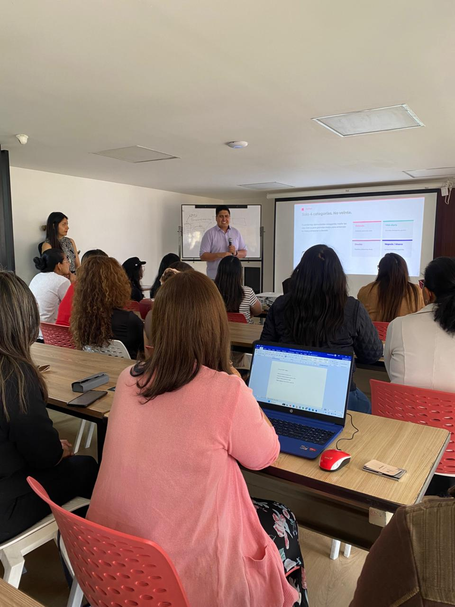

La mayoría de la gente que se frustra con la inteligencia artificial y el dinero comete el mismo error: le pide a la IA que ordene un caos. Y la IA, por buena que sea, solo puede trabajar con lo que le das.

Por eso armé un kit gratuito que invierte el orden de las cosas. Primero ordenas tú, con un método simple. Después usas la IA para lo que de verdad sirve. En este artículo te resumo el método y al final te dejo el kit completo.

## Lo probé en vivo, con 45 personas

Antes de lanzarlo al público, llevé este método al Taller de Finanzas IA que organizamos con CODEIS en el Cowork CCQ de Quito. Cuarenta y cinco emprendedores y profesionales independientes, muchos con negocios ya corriendo, otros con proyectos nuevos.

El patrón que vi repetirse fue siempre el mismo: las personas con más caos financiero eran las que más querían que la IA les resolviera el problema. Y cuando entendieron que el orden va primero, el cambio fue inmediato.

El kit sale de esa sesión. Lo que funcionó en el taller es exactamente lo que está empaquetado.

## El error más común

La IA es una herramienta de análisis, no un asesor financiero. Cuando entiendes esa diferencia, la usas bien. Cuando la confundes, terminas decidiendo sobre algo que la IA supuso o inventó.

La regla de fondo es simple: la IA amplifica lo que le das. Datos claros, claridad de vuelta. Datos vagos, generalidades. Por eso el orden va primero.

## El método de cinco pasos

**Claridad.** Separa tus finanzas personales de las del negocio. Si las mezclas, no sabes si el negocio genera dinero o si lo sostienes con tu bolsillo. No hace falta abrir dos cuentas: basta con marcar cada movimiento como personal o de negocio.

**Orden.** Registra cada movimiento con una categoría consistente. Usar siempre las mismas categorías es lo que te permite comparar mes a mes.

**Dirección.** Define un presupuesto antes de que empiece el mes y al menos una meta con cuatro elementos: qué quieres, cuánto necesitas, cuándo y cuánto apartas por mes. Sin esos cuatro, es un deseo, no un plan.

**Control.** Veinte minutos de revisión a la semana y un cierre de cuarenta y cinco minutos al mes. La revisión semanal sirve para detectar desviaciones cuando todavía puedes corregirlas.

**Copiloto.** Recién ahora entra la IA. Para resumir, clasificar, comparar meses y detectar patrones en los datos que tú le das. La decisión final se queda contigo, siempre.

## Qué incluye el kit gratuito

- Un mini ebook que explica el método y la IA en simple, sin tecnicismos.
- Un workbook de Excel que registra tus movimientos y calcula tus totales solo.
- Doce prompts listos para copiar y pegar en Claude o ChatGPT.
- Cuatro asistentes para Claude que guían sesiones completas de finanzas.
- Los checklists de la rutina semanal y el cierre mensual.
- Una guía de privacidad para usar la IA sin exponer tus datos.

Todos los ejemplos son ficticios y el material es educativo. No reemplaza a un contador ni a un asesor financiero. Te ayuda a llegar organizado a donde un profesional te atiende mejor.

## Descárgalo gratis

Está completo y es gratis. Déjame tu correo en [franciscoabad.com/kit](/kit) y te lo envío al instante.

---

*Francisco Abad fue Director General del IESS de junio a diciembre de 2025. Hoy lidera BrainTech, firma AI-native de transformación de negocios, y preside el directorio de CODEIS. Escribe sobre lo que se ve cuando diriges instituciones desde adentro.*
